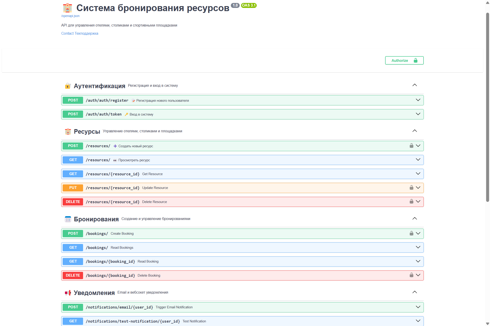

# 🏨 Система бронирования ресурсов

**FastAPI-приложение для управления бронированием отелей, столиков и спортивных площадок**

## 🔥 Основные возможности:
- **🔐 Аутентификация** через JWT-токены
- **🏨 Ресурсы** (отели/столики/площадки) с CRUD-операциями
- **📅 Бронирования** с проверкой доступности
- **📢 Уведомления** (email + WebSocket)
- **👨‍💻 Админ-панель** для владельцев ресурсов

## 🛠 Технологии:
- Python 3.10+
- FastAPI
- SQLAlchemy 2.0
- PostgreSQL/SQLite
- Pydantic V2
- Alembic (миграции)

## 🚀 Быстрый старт:
```bash
uvicorn app.main:app --reload



pip install -r requirements.txt
uvicorn app.main:app --reload
http://localhost:8000/docs